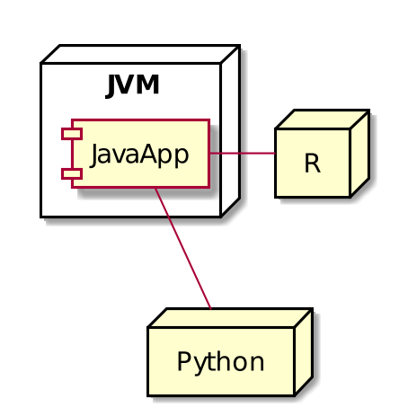
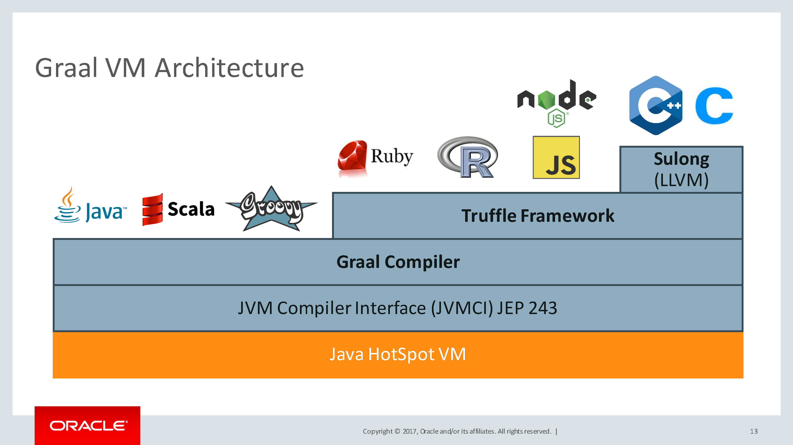

name: inverse
layout: true
class: center, middle, inverse
---
# Graal - one VM to rule them all

.footnote[http://github.com/KSkitek/graalVMLT]

---
layout: false
# Why talking about GraalVM



---
# Problems

* Performance
* Complexity
* Debugging


---
# GraalVM to the rescue

* Native
* Polyglot
* Embedable

---
# Graal layers



???
Tell about:
* JIT
* AST and AST interpreter and compiler
* native, with SubstrateVM

---
# Why it works?

## Static vs dynamic compilation
## JIT

???
https://www.slideshare.net/martintoshev/jvm-the-graal-vm

Pytania
* czym jest JIT
* Jakie mamy rodzaje JITów w JVM?

---
name: inverse
layout: true
class: center, middle, inverse
---

# Demo time

---
# Performance and Native code

### Hello vs GraalVM Hello vs native Hello

???
```bash
src/main/java/run.sh
```

Questions:
* What is AOT?
* When native-image cannot be used or is hard to use?

### Idea for performance showcase with R
https://github.com/nuest/fastr-docker

---
layout: false
# Limitations

| What | Support Status|
| ---------- | ----------|
| Dynamic Class Loading / Unloading | Not supported|
| Reflection | Mostly supported|
| Dynamic Proxy | Mostly supported|
| Java Native Interface (JNI) | Mostly supported|
| Unsafe Memory Access | Mostly supported |
| Static Initializers | Partially supported|
| InvokeDynamic Bytecode and Method Handles | Not supported|
| Lambda Expressions | Supported|
| Synchronized, wait, and notify | Supported|
| Finalizers | Not supported|
| Weak References | Supported|
| Threads | Supported|
| Identity Hash Code | Supported|
| Security Manager | Not supported|
| JVMTI, JMX, other native VM interfaces | Not supported|

.footnote[[source](https://github.com/oracle/graal/blob/master/substratevm/LIMITATIONS.md)]

---
name: inverse
layout: true
class: center, middle, inverse
---
# Polyglot and Embedable

???

* Java + R
* JS + R
* Java + JS
* also show oracle/examples and RServe use cases

TODO debugging Java + R

https://medium.com/graalvm/debugging-polyglot-node-js-ruby-r-apps-with-graalvm-81b1bb2614db

---
# Questions?

---
layout: false
# Sources

* 
* https://medium.com/graalvm/debugging-polyglot-node-js-ruby-r-apps-with-graalvm-81b1bb2614db
* http://chrisseaton.com/truffleruby/jokerconf17/
* https://www.jfokus.se/jfokus17/preso/Graal-at-Twitter.pdf